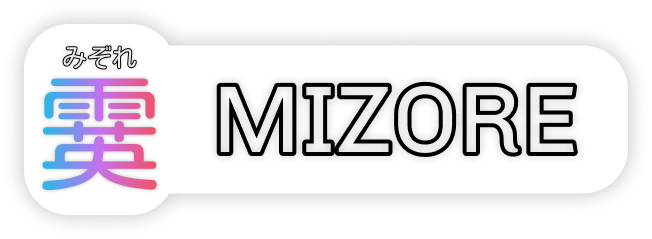

<p align="center"></p>

霙 (mizore) is an accessible web interface for the uncho! server written using [Next.js](https://nextjs.org/). 🚀

[易速 (isoku)](https://github.com/nrabulinski/isoku) is *[will be]* serving data for mizore.

*This project is in it's very early stage -* ***it might change significantly in the future!***

## Issues

If you find any issues or styling inconsistencies, please submit an issue.

Every issue should contain at least:
* Explaination of the problem *(i.e. when and where it occurs)*
* Steps to reproduce

Optional:
* Image or video representing the issue

## Local developement

To run this project locally, you need [Node.js](https://nodejs.org/) installed on your system.

```bash
# Clone the repository to your current directory
git clone https://github.com/wojexe/mizore-next.git

# cd into the cloned mizore-next repo
cd mizore-next

# Install required packages
npm i

# Run the developement server 
npm run dev
```

Open [http://localhost:3000](http://localhost:3000) with your browser to see the result.
